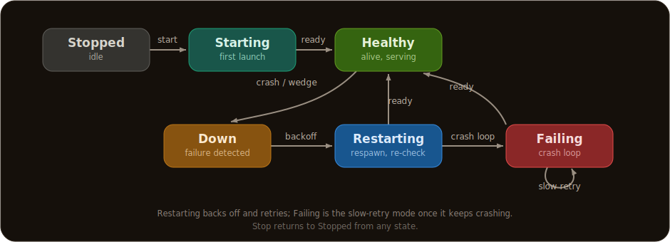

<p align="center">
  
</p>

# Hearth

<p align="center">
  <a href="https://github.com/adamskijow/Hearth/actions/workflows/ci.yml"></a>
  <a href="https://github.com/adamskijow/Hearth/releases/latest"></a>
  <a href="LICENSE"></a>
  
</p>

Hearth is a background supervisor that keeps a local LLM runner (Ollama, with LM
Studio and mlx_lm support) alive and serving on a headless Mac.

It is an availability layer, not an inference layer. Hearth watches the runner,
restarts it when it dies **or wedges**, keeps the Mac awake while it is meant to be
serving, and tells you when something goes wrong. It is not a chat UI or a
replacement for Ollama or LM Studio; it supervises the runner you already run.

Why a Mac-specific tool, and not Docker? On Apple Silicon you run Ollama natively:
[Docker on macOS has no GPU passthrough and runs CPU-only](https://github.com/ollama/ollama/blob/main/docs/faq.mdx#how-do-i-use-ollama-with-gpu-acceleration-in-docker),
throwing away the Metal GPU and unified memory that are the whole reason to run
locally. A native runner has none of the container world's health-probe and restart
machinery, so the readiness-based recovery you would get from Kubernetes has to come
from somewhere. Hearth is that layer.

<p align="center">
  
</p>

<p align="center"><em>Catching a runner that is alive but wedged, and recovering it on its own (<code>make demo</code>).</em></p>

**Contents** &nbsp; [Quickstart](#quickstart) · [Why this exists](#why-this-exists) · [Requirements](#requirements) · [Install](#install-and-build) · [Configure](#configure) · [How it works](#how-it-works) · [Security](#security-and-exposing-the-runner) · [Architecture](#architecture)

## Documentation

The README is the tour; the operational detail lives in `docs/`:

- **[Configuration reference](docs/configuration.md):** every config key, its type, and its default.
- **[Ollama setup guide](docs/ollama.md):** Homebrew Ollama, Ollama.app, deep probes, and integration wording.
- **[Remote control and local status](docs/remote-control.md):** the HTTP control endpoint, the `hearth` CLI, and monitoring.
- **[Running headless](docs/running-headless.md):** the login agent, the root daemon, and the wedge-recovery reboot ladder.
- **[Troubleshooting](docs/troubleshooting.md):** the common failure modes and their fixes.
- **[Integrating with Hearth](docs/integrating.md):** for an app that depends on a local runner being up.
- **[Reverse proxy and TLS](docs/reverse-proxy.md):** reaching the runner or the control endpoint securely from off this machine.
- **[Observability roadmap](docs/observability-roadmap.md):** follow-up metrics work such as throughput and OOM fixtures.
- **[Known limitations and design choices](docs/limitations.md):** what Hearth does not do, and why.
- **[Development](docs/development.md):** the test suite, signing, and cutting a release.

## Quickstart

If you already run Ollama on this Mac:

```
brew install --cask adamskijow/tap/hearth
open /Applications/Hearth.app
```

A flame appears in the menubar. Hearth auto-detects Ollama at the Homebrew path,
starts supervising it, and keeps the Mac awake while it serves. That is the whole
setup. Check it from a terminal with `hearth doctor` (config and environment
preflight) and `hearth status` (phase, uptime, restarts, resident models). If your
runner is elsewhere or you want LM Studio or mlx_lm, see
[Configure](#configure); if something looks off, see
[Troubleshooting](docs/troubleshooting.md).

Two common Ollama setups:

- **Homebrew Ollama:** stop `brew services` if it is already supervising Ollama,
  then let Hearth run managed mode. `hearth doctor` warns when another manager
  would fight Hearth over the same port.
- **Ollama.app:** the official app already starts its own server. Use attached
  mode so Hearth watches that server instead of launching a second one. See the
  [Ollama setup guide](docs/ollama.md#ollamaapp-attached-mode).

## Why this exists

If you run a local model server on a Mac you leave in a closet, the usual fix is a
launchd plist or `brew services` with `KeepAlive`, which relaunches the runner when
the process exits. That handles a clean crash. It does not handle the failure that
actually wastes your afternoon: the runner is still running, but no longer answering.

That "alive but wedged" state is common and well reported: the runner hangs after a
few requests with no error ([ollama#6616](https://github.com/ollama/ollama/issues/6616)),
the GPU stops responding and "the service needs to be rebooted"
([Framework](https://community.frame.work/t/ollama-model-runner-unexpectedly-stopped-gpu-hang/76220)),
or Ollama silently reverts to CPU and spins for hours
([ollama#8594](https://github.com/ollama/ollama/issues/8594)). The process is up the
whole time, so a **liveness** check ("is the PID there?") is satisfied and launchd
does nothing.

Hearth probes **readiness** ("does the API actually answer in time?"), so it catches
the wedge, not just the crash. An optional deep probe goes further, running a tiny
generation on an interval to catch the case where the HTTP server still answers while
the model or GPU is hung. It also does what a process supervisor was never meant to:
keeps the Mac awake while serving, pins `OLLAMA_HOST` so the runner binds where you
expect, and alerts you when something breaks. It runs on top of launchd, not instead
of it, to make a local runner behave like a real, always-on service on a machine
nobody is sitting at.

## Requirements

macOS 14 or later, and an existing runner install (Hearth supervises the runner, it
does not install it). Ollama is the default, expected at `/opt/homebrew/bin/ollama`;
LM Studio (in attached mode) and mlx_lm are also supported, selected with `runner`
and the matching binary path. The [configuration reference](docs/configuration.md)
and [Troubleshooting](docs/troubleshooting.md) have the per-runner notes. Hearth has
no third-party Swift dependencies; it builds against Apple system frameworks only.

## Install and build

Install the signed release with Homebrew:

```
brew install --cask adamskijow/tap/hearth
```

The cask installs `Hearth.app` and puts the `hearth` CLI (`doctor`, `status`,
`setup`, `wait-ready`) on your PATH. To build from a checkout instead,
`swift build -c release && swift run Hearth`; for a day-to-day local install,
`make install` ad-hoc signs the app into `/Applications` (and `make uninstall`
removes it). Hearth is distributed as a Developer ID signed, notarized build, not via
the App Store, whose sandbox forbids the process supervision that is the whole job.
The build, signing, and release pipeline is in [Development](docs/development.md).

## Configure

Configure Hearth from **Preferences** in the menubar (Cmd-comma) or by editing
`~/Library/Application Support/Hearth/config.json` directly; either way changes apply
**without a restart**. On first launch Hearth writes a starter template with the
runner binary auto detected, and every key is optional. The keys most people set are
`runner`/`mode` (which runner, and whether Hearth launches it or watches one you
started), the runner's binary path and `host`/`port`, `ntfyTopic` for phone alerts,
and `controlEnabled`/`controlToken` for the
[control endpoint](docs/remote-control.md). The
[configuration reference](docs/configuration.md) lists every key, its type, and its
default, with a full example.

## How it works

Hearth's default is **managed** mode: it spawns the runner as a child in its own
process group and owns it. Because Hearth sets the child's environment, `OLLAMA_HOST`
is pinned to your configured host and port, sidestepping the launchd env trap; and
because it owns the whole process group, a restart takes the runner's helpers (an
Ollama serve forks a `llama-server` that holds GPU memory) down together, so nothing
is orphaned to leak across a restart loop. If Hearth itself is SIGKILLed before it can
tear down, it recovers on the next launch by sweeping the runner group it recorded to
disk, guarded by start time so a recycled PID is never mistaken for it. In
**attached** mode it spawns nothing and only monitors a runner something else
started, the reliable way to use LM Studio.

Health is **readiness**, not just liveness. Liveness asks whether the process is
alive; readiness asks whether the runner's endpoint actually answers in time.
Readiness is the important half, because it catches the alive-but-wedged runner a
liveness check calls healthy. The optional deep probe (`probeModel`) goes one level
deeper, running a one-token generation on a slower interval to catch a model or GPU
hang while the HTTP server still answers.

When the runner stops serving, Hearth restarts it on an exponential backoff. If
failures keep coming (a crash loop), it stops thrashing, enters a failing state, and
retries slowly while it keeps probing, so it recovers on its own once the underlying
problem clears.

<p align="center">
  
</p>

Along the way it holds an IOKit power assertion so the Mac does not idle-sleep out
from under a service that is meant to be up, classifies how the child exited (clean
stop vs crash vs out-of-memory kill, which matters on a unified-memory Mac), and
notifies you on the transitions that matter (down, recovered, failing) over local
alerts, ntfy to your phone, and an optional webhook. Opt-in settings cover slow
degradation too: scheduled maintenance restarts, adopting an upgraded binary, and
memory and thermal pressure alerts.

## Security and exposing the runner

Hearth runs unsandboxed by necessity: supervising another process is exactly what the
App Sandbox forbids, so it ships with the sandbox off and the Hardened Runtime on, as
a Developer ID notarized build. It sends only short status text to notifiers, never
prompts, model data, or runner content.

It is conservative about putting the runner on the network. By default the runner
listens on `127.0.0.1`. For a machine on a network you trust, setting `host` to
`0.0.0.0` is the simple path (`hearth doctor` prints the URL and the firewall caveat).
Do not expose the runner raw to an untrusted network: it has no authentication of its
own, so keep it on `127.0.0.1` behind an authenticating reverse proxy bound to a
private (Tailscale) address (the [reverse-proxy guide](docs/reverse-proxy.md) has Caddy and
nginx examples). Hearth's own control endpoint is separate: off by default, a bearer
token required when on, bound to a private interface, and only for supervision, never
inference.

## Architecture

The code splits into a logic half and a presentation half with a hard line between.
`SupervisorCore` holds all the decision logic and imports no AppKit or SwiftUI: time,
process control, HTTP, power, and notifications sit behind protocols, so it is unit
tested with fakes and never touches real I/O. Its heart is an explicit restart state
machine and a pure exit classifier that take the current time as an argument, so
their behavior is fully determined by their inputs. `Hearth` is the executable that
wires the core to real process spawning (`posix_spawn` in a dedicated process group),
URLSession, IOKit, the Network framework, SMAppService, and UserNotifications, and
renders the published state.

## Roadmap

The core is solid: a tested state machine, readiness and deep probes, and the full
recovery ladder. Ollama, LM Studio, and mlx_lm are supported today, and adding
another runner is a small, contained change when someone needs one.

Where it is heading:

- **Least privilege.** Building on the root daemon's required `runnerUser` drop, a
  minimal root helper so the supervisor itself need not run as root.
- **Reach.** Full Tailscale auto-configuration (address detection already ships),
  and turnkey setup for the authenticating reverse proxy it documents today.
- **Metrics.** A tokens-per-second readout, alongside the existing thermal and
  memory ones.

## Contributing

Contributions are welcome. The project values the logic/presentation split:
decision logic belongs in `SupervisorCore`, behind protocols, with tests, and never
imports AppKit or SwiftUI; anything runner specific belongs in the runner
implementation, not the engine or the UI. Keep new dependencies out unless there is
a strong reason. Run `make test` before sending a change; testing and releasing are
covered in [docs/development.md](docs/development.md).

## License

Hearth is released under the MIT License. See the [LICENSE](LICENSE) file for the
full text. There are no third party dependencies, so there are no additional
license obligations to carry.
