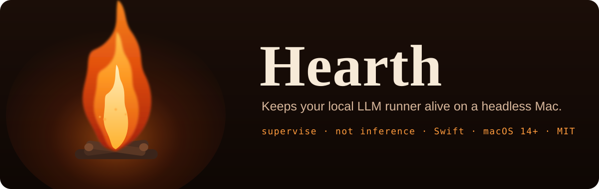

<p align="center">
  
</p>

# Hearth

<p align="center">
  <a href="https://github.com/adamskijow/Hearth/actions/workflows/ci.yml"></a>
  <a href="https://github.com/adamskijow/Hearth/releases/latest"></a>
  <a href="LICENSE"></a>
  
</p>

**Keep local AI runners alive on an always-on Mac.** Hearth supervises Ollama,
LM Studio, and `mlx_lm`, catching both ordinary crashes and runners that are still
running but no longer answering. It preserves native Metal GPU use, keeps the Mac
awake while serving, and alerts you when something breaks.

Built for an unattended Mac mini, home-lab server, or desktop left on overnight.
Your apps keep talking to the runner exactly as before. *Independent project, not
affiliated with Ollama.*

<p align="center">
  
</p>

<p align="center"><em>Catching a runner that is still running but stuck (not answering), and recovering it on its own (<code>make demo</code>).</em></p>

## Why

`launchd` and `brew services` can relaunch an exited process, but cannot detect a
runner that is alive while its API or inference engine is wedged. Hearth checks
readiness and can run a tiny generation probe, then performs bounded recovery
without moving the runner into CPU-only Docker. See [how Hearth works](docs/how-it-works.md)
for the mechanism and live GPU-crash evidence.

## Choose the right app

| | Best for | Recovery |
|---|---|---|
| **Hearth** | Unattended local runners | Starts and restarts runners, keeps the Mac awake, and can escalate persistent GPU/driver wedges |
| **[Hearth Monitor](docs/hearth-monitor.md)** | Apple’s on-device model and attached local runners | Detects and reports failures; optionally shows recovery coverage from a separate full Hearth installation |

Full Hearth uses Developer ID distribution because process supervision cannot fit
inside App Sandbox. Hearth Monitor is the sandboxed companion built for the Mac
App Store. Both can detect an inference-level runner wedge; only full Hearth
controls the runner.

Hearth Monitor 0.2.0 is also available as a
[public GitHub beta](https://github.com/adamskijow/Hearth/releases/tag/hearth-monitor-v0.2.0)
while real-world use informs the App Store release.

## Install full Hearth

If you already run Ollama on this Mac:

```sh
brew install --cask adamskijow/tap/hearth
open /Applications/Hearth.app
```

A flame appears in the menubar; Hearth auto-detects Ollama, starts supervising it,
and keeps the Mac awake. It is working when the flame has no warning badge and
the menu says **Healthy**. `hearth doctor` checks the setup; `hearth status` shows
health, uptime, and loaded models.

If you use Ollama.app or `brew services`, read the
[Ollama setup guide](docs/ollama.md) before choosing managed or attached mode.
Most options live in **Preferences**; every advanced setting is in the
[configuration reference](docs/configuration.md).

## Security

Full Hearth is signed, notarized, and unsandboxed only because it must supervise
another process. Hearth sends notifier status, not prompts or model output, and
Hearth Monitor contains no analytics or tracking. Runners remain bound to
`127.0.0.1` by default. See the [privacy policy](PRIVACY.md) and
[network exposure guide](docs/reverse-proxy.md).

## Learn more

- [Documentation index](docs/README.md)
- [FAQ](docs/faq.md) and [troubleshooting](docs/troubleshooting.md)
- [How Hearth works](docs/how-it-works.md)
- [Hearth Monitor guide](docs/hearth-monitor.md)
- [Running headless](docs/running-headless.md)

Contributions are welcome; start with the [development guide](docs/development.md).
Released under the [MIT License](LICENSE) with no third-party dependencies.
