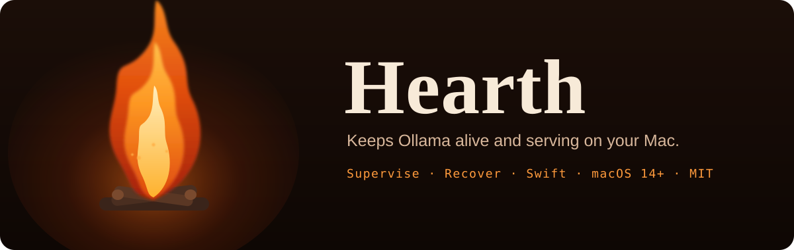

<p align="center">
  
</p>

# Hearth

<p align="center">
  <a href="https://github.com/adamskijow/Hearth/actions/workflows/ci.yml"></a>
  <a href="https://github.com/adamskijow/Hearth/releases/latest"></a>
  <a href="LICENSE"></a>
  
</p>

**Keep Ollama alive and serving on an always-on Mac.** Hearth detects process
crashes, API failures, and hung inference, keeps the Mac awake, and sends failure
alerts. Recovery preserves Ollama's native Metal GPU use.

It suits an unattended Mac mini, home-lab server, or desktop left on overnight.
Apps can use Ollama's normal endpoint. Automatic inference recovery requires
client traffic through Hearth's optional metrics proxy. Hearth is an independent
community project, unaffiliated with Ollama.

Hearth requires macOS 14 or later on Apple silicon.

<p align="center">
  
</p>

<p align="center"><em>Detecting and recovering a hung runner (<code>make demo</code>).</em></p>

## Why

`launchd` and `brew services` relaunch exited processes. Hearth also checks API
readiness and can run a tiny generation probe, catching hangs that leave the
process alive. Recovery stays native, retaining Metal GPU acceleration. See
[how Hearth works](docs/how-it-works.md).

## Recovery coverage

Managed mode starts and restarts Ollama. Attached mode watches Ollama.app or an
existing service and leaves process control to that owner. Choose one manager
for Ollama to avoid competing restarts.

Process exits and API failures recover automatically in managed mode. Inference
checks require a configured resident model. Automatic inference recovery also
requires client traffic through the metrics proxy. See [known
limitations](docs/limitations.md) for current traffic-visibility limits.

## Install Hearth

If you already run Ollama on this Mac:

```sh
brew install --cask adamskijow/tap/hearth
open /Applications/Hearth.app
```

A flame appears in the menu bar. **Healthy** confirms that the runner answers.
`hearth doctor` checks setup; `hearth status` shows health, uptime, and models.

If you use Ollama.app or `brew services`, read the
[Ollama setup guide](docs/ollama.md) before choosing managed or attached mode.
Most options live in **Preferences**; every advanced setting is in the
[configuration reference](docs/configuration.md).

## Other runners

Ollama is the primary setup and validation path. Existing `mlx_lm`, LM Studio,
and experimental Osaurus integrations remain available. Managed MLX requires a
startup model; LM Studio supports attached mode only. See the [configuration
reference](docs/configuration.md) and [known limitations](docs/limitations.md)
for their coverage.

## Security

Hearth is signed, notarized, and unsandboxed for process supervision. Alerts
carry Hearth status; log excerpts require an explicit opt-in. Runner endpoints
default to `127.0.0.1`. See the
[privacy policy](PRIVACY.md) and [network guide](docs/reverse-proxy.md).

## Learn more

- [Documentation index](docs/README.md)
- [FAQ](docs/faq.md) and [troubleshooting](docs/troubleshooting.md)
- [How Hearth works](docs/how-it-works.md)
- [Product plan](docs/product-plan.md)
- [Running headless](docs/running-headless.md)

Contributions are welcome; start with the [development guide](docs/development.md).
Released under the [MIT License](LICENSE) with no third-party dependencies.
