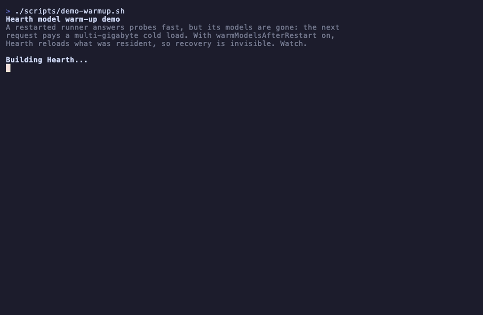

<!-- SPDX-License-Identifier: MIT -->
# How Hearth works, and why

## The failure it targets

macOS's built-in keep-it-running tools (a launchd plist, or `brew services` with
`KeepAlive`) relaunch the runner when the process *exits*. That handles a clean
crash. It does not handle the failure that wastes your afternoon: the runner is
still running, but no longer answering.

That "alive but wedged" state shows up in user reports: the runner hangs after a few
requests with no error ([ollama#6616](https://github.com/ollama/ollama/issues/6616)),
the GPU stops responding and "the service needs to be rebooted"
([Framework](https://community.frame.work/t/ollama-model-runner-unexpectedly-stopped-gpu-hang/76220)),
or Ollama silently reverts to CPU and spins for hours
([ollama#8594](https://github.com/ollama/ollama/issues/8594)). The process stays up
the whole time, so a **liveness** check ("is the PID there?") is satisfied and
launchd does nothing.

Hearth probes **readiness** ("does the API answer in time?"), so it catches the
wedge, not just the crash, and it runs on top of launchd rather than instead of it.

## Why native, not Docker

On Apple Silicon you run Ollama natively: [Docker on macOS has no GPU passthrough and
runs CPU-only](https://github.com/ollama/ollama/blob/main/docs/faq.mdx#how-do-i-use-ollama-with-gpu-acceleration-in-docker),
throwing away the Metal GPU and unified memory that are the whole reason to run
locally. A native runner has none of the container world's health-probe and restart
machinery, so the readiness-based recovery you would get from Kubernetes has to come
from somewhere. Hearth is that layer.

## Managed and attached

In **managed** mode (the default) Hearth owns the runner as a child in its own
process group: it pins `OLLAMA_HOST` where you expect, and a restart takes the
runner's helpers down with it (an Ollama serve forks a `llama-server` that holds GPU
memory), so nothing is orphaned to leak across a restart loop. If Hearth itself is
SIGKILLed before it can tear down, it sweeps the runner group it recorded to disk on
the next launch, guarded by start time so a recycled PID is never mistaken for it.

**Attached** mode watches a runner something else started and spawns nothing, the
reliable way to use LM Studio.

## Readiness and the deep probe

Readiness probing is the shallow layer; the optional deep probe (`probeModel`) adds a
one-token generation on a slower interval to catch a model or GPU hang while the HTTP
server still answers. This is not hypothetical: a real GPU crash (image generation
exhausting unified memory) was caught this way live, `/api/version` answering in
under a millisecond while a one-token generation hung for 40 seconds, then a heavier
repeat driving a memory-pressure kill, crash loop, and recovery. The run is in the
[validation report](../VALIDATION-REPORT.md#live-gpu-crash-test).

  

## Recovery

When the runner stops serving, Hearth restarts it on an exponential backoff. If
failures keep coming (a crash loop), it backs off and retries slowly instead of
thrashing, and keeps probing, so it recovers on its own once the underlying problem
clears. A restart clears the runner's loaded models, so with `warmModelsAfterRestart`
on, Hearth reloads what was resident once the runner is healthy, and the next request
pays no multi-gigabyte cold start.

  

Along the way it holds an IOKit power assertion so the Mac does not idle-sleep out
from under a service meant to be up, classifies how the child exited (clean stop,
crash, or out-of-memory kill, which matters on a unified-memory Mac), and notifies
you on the transitions that matter (down, recovered, failing) over local
notifications, ntfy to your phone, and an optional webhook. Opt-in settings cover
slow degradation too: scheduled maintenance restarts, adopting an upgraded binary,
and memory and thermal pressure alerts.

## Architecture

The code keeps a hard line between logic and presentation. `SupervisorCore` holds all
the decision logic (an explicit restart state machine and a pure exit classifier,
with time, process control, HTTP, power, and notifications behind protocols) and
imports no AppKit or SwiftUI, so it is unit tested with fakes and never touches real
I/O. `Hearth` is the executable that wires that core to real process spawning
(`posix_spawn` in a dedicated process group), URLSession, IOKit, the Network
framework, SMAppService, and UserNotifications, and renders the published state.
