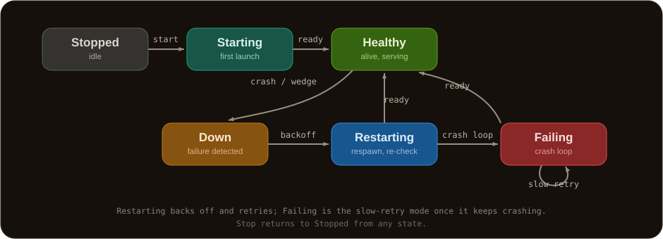
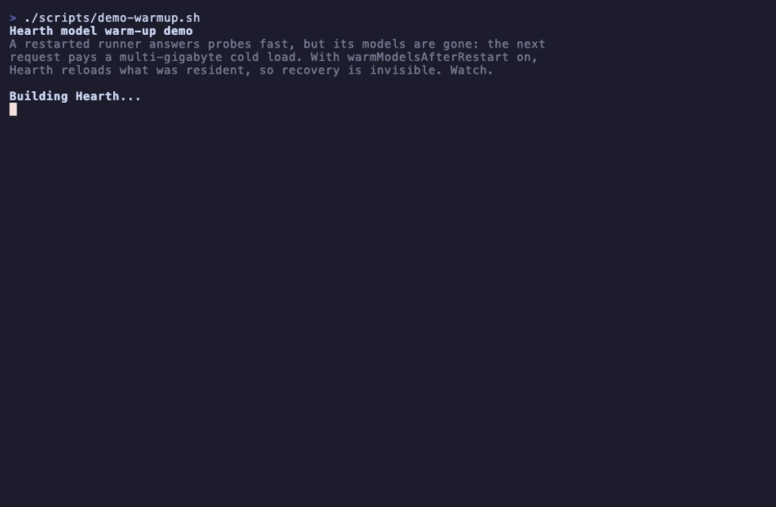

<!-- SPDX-License-Identifier: MIT -->
# How Hearth works

## Failure model

`launchd` and `brew services` relaunch an exited process. A local AI runner can
also remain alive while its API or inference engine hangs. The PID survives, so
liveness checks stay green.

Hearth probes API readiness and can add a one-token inference probe. This covers
process exits, API hangs, and inference hangs while retaining native Metal GPU
acceleration. [Live validation](../VALIDATION-REPORT.md#live-gpu-crash-test)
caught an inference hang while Ollama's version endpoint still answered.

## Managed and attached modes

Managed mode owns the runner as a child process group. A restart terminates the
runner and helpers such as Ollama's `llama-server`. Hearth records process identity
and sweeps a surviving group after an abrupt Hearth termination, guarded by PID
start time.

Attached mode watches a runner owned by another app or service manager. Hearth
leaves process control to that owner. LM Studio uses attached mode.

## Health checks

The shallow probe checks a lightweight API endpoint. `probeModel` adds a slower,
one-token generation while the selected model is resident. Scheduled checks avoid
cold-loading idle models.

A long client generation can resemble an inference timeout. Automatic recovery
from deep-probe failures therefore requires client-traffic visibility from the
metrics proxy. Hearth defers probes during observed work and can restart after a
confirmed inference failure when the proxy reports idle. The proxy currently
counts connections, which limits what this signal proves; see
[known limitations](limitations.md). Without traffic visibility Hearth alerts
and preserves the running workload. Process exits and shallow API failures
retain automatic recovery.

  

## Recovery

Hearth restarts failed runners with exponential backoff. Repeated failures enter
a slower crash-loop cadence until health returns. `warmModelsAfterRestart` can
reload previously resident models after recovery.

  

While supervising, Hearth holds an IOKit power assertion, classifies exits, and
records each incident. Optional features cover scheduled maintenance restarts,
binary upgrades, memory limits, thermal alerts, ntfy, webhooks, and guarded reboot
escalation.

## Architecture

`SupervisorCore` contains the state machine and policy behind testable protocols.
The `Hearth` executable supplies process control, networking, IOKit, launchd,
notifications, and AppKit presentation. This split keeps recovery logic independent
of UI and operating-system I/O.
